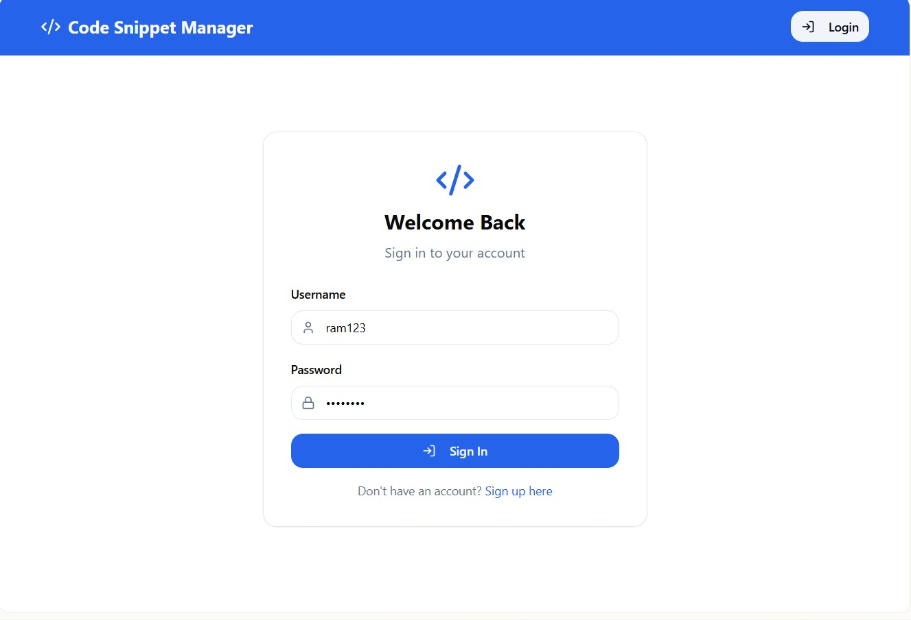
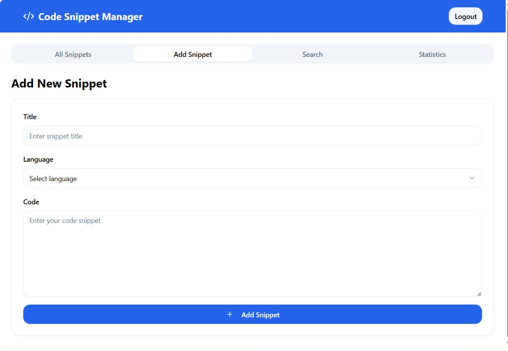
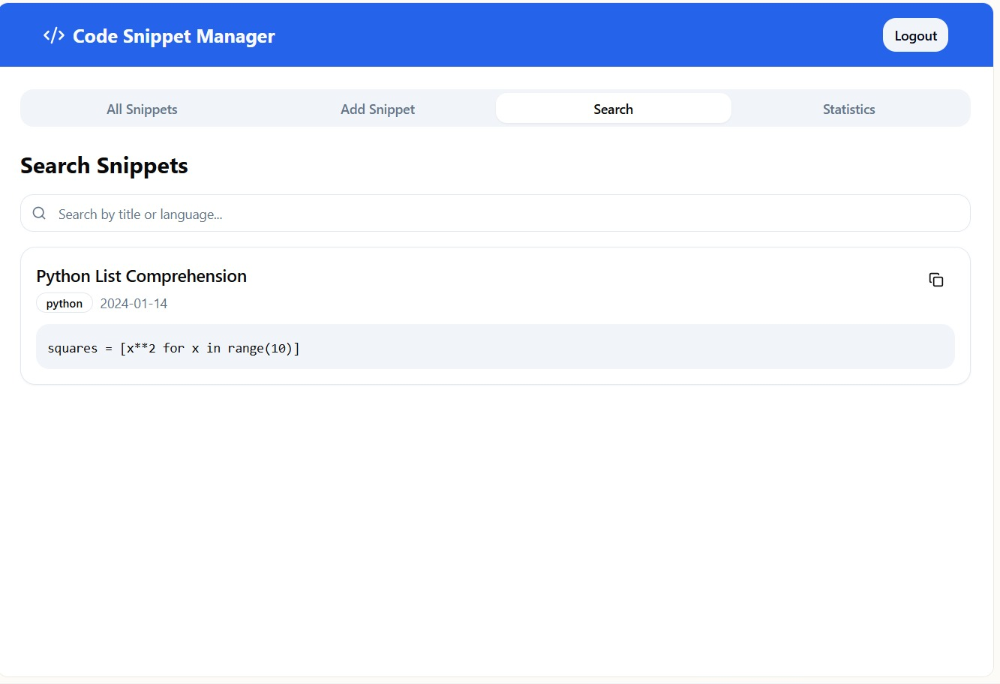
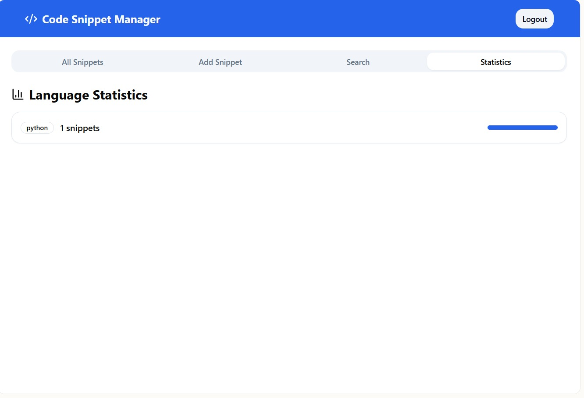
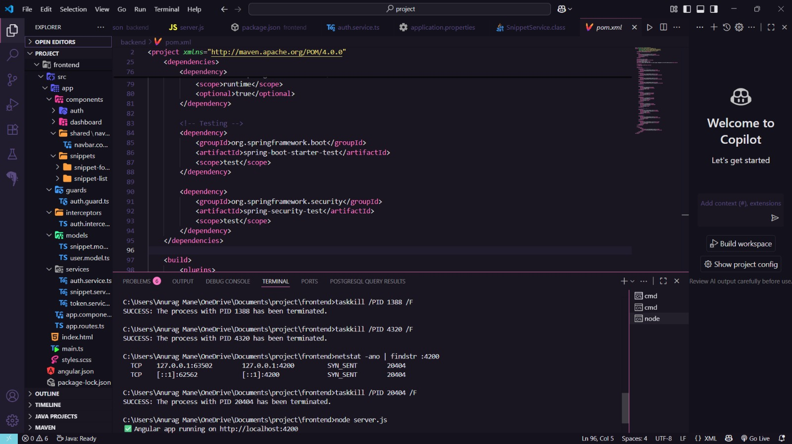

# 🚀 Code Snippet Manager  

<p align="center">
  <b>A Modern Full-Stack Web Application for Managing Code Snippets</b>  
</p>

<p align="center">
  
  
  
  
  
</p>

---

## 👨‍💻 Team Members
- **Pavan Damji** *(Leader)*  
- Anurag Mane  
- Kaushik Hatte  
- Ganesh Hibare  

---

## 🖼️ Screenshots  

### 🔐 Authentication  
<p align="center">
  
</p>  

### 📂 All Snippets  
<p align="center">
  
</p> 

### 📝 Add Snippet  
<p align="center">
  
</p>  

### 🔎 Search Snippets  
<p align="center">
  
</p>  

### 📊 Statistics  
<p align="center">
  
</p>  

### 📊 Code  
<p align="center">
  
</p> 

 


---

## 🛠️ Tech Stack
- **Backend** → Spring Boot 3.x, Spring Security, Spring Data JPA, JWT Authentication  
- **Frontend** → Angular 17+, TypeScript, Bootstrap 5, Angular Material  
- **Database** → PostgreSQL 12+  
- **Build Tool** → Maven 3.6+  
- **Architecture** → MVC Pattern with JWT Authentication  

---

## 📁 Project Structure

```
code-snippet-manager/
├── backend/                    # Spring Boot Application
│   ├── src/
│   │   ├── main/
│   │   │   ├── java/com/cse/snippetmanager/
│   │   │   │   ├── controller/     # REST Controllers
│   │   │   │   │   ├── AuthController.java
│   │   │   │   │   ├── SnippetController.java
│   │   │   │   │   └── UserController.java
│   │   │   │   ├── service/        # Business Logic
│   │   │   │   │   ├── AuthService.java
│   │   │   │   │   ├── SnippetService.java
│   │   │   │   │   └── UserService.java
│   │   │   │   ├── repository/     # Data Access Layer
│   │   │   │   │   ├── UserRepository.java
│   │   │   │   │   └── SnippetRepository.java
│   │   │   │   ├── model/          # Entity Classes
│   │   │   │   │   ├── User.java
│   │   │   │   │   └── Snippet.java
│   │   │   │   ├── dto/            # Data Transfer Objects
│   │   │   │   │   ├── LoginRequest.java
│   │   │   │   │   ├── SignupRequest.java
│   │   │   │   │   ├── JwtResponse.java
│   │   │   │   │   └── SnippetDto.java
│   │   │   │   ├── config/         # Configuration Classes
│   │   │   │   │   ├── SecurityConfig.java
│   │   │   │   │   ├── JwtConfig.java
│   │   │   │   │   └── CorsConfig.java
│   │   │   │   └── security/       # JWT Security
│   │   │   │       ├── JwtUtils.java
│   │   │   │       ├── JwtAuthFilter.java
│   │   │   │       └── UserDetailsImpl.java
│   │   │   └── resources/
│   │   │       ├── application.properties
│   │   │       └── data.sql
│   │   └── test/
│   └── pom.xml                 # Maven Dependencies
├── frontend/                   # Angular Application
│   ├── src/
│   │   ├── app/
│   │   │   ├── components/     # Angular Components
│   │   │   │   ├── auth/
│   │   │   │   │   ├── login/
│   │   │   │   │   └── signup/
│   │   │   │   ├── dashboard/
│   │   │   │   ├── snippets/
│   │   │   │   └── shared/
│   │   │   ├── services/       # HTTP Services
│   │   │   │   ├── auth.service.ts
│   │   │   │   ├── snippet.service.ts
│   │   │   │   └── token.service.ts
│   │   │   ├── models/         # TypeScript Models
│   │   │   │   ├── user.model.ts
│   │   │   │   └── snippet.model.ts
│   │   │   ├── guards/         # Route Guards
│   │   │   │   └── auth.guard.ts
│   │   │   └── interceptors/   # HTTP Interceptors
│   │   │       └── auth.interceptor.ts
│   │   ├── assets/
│   │   └── environments/
│   ├── package.json
│   └── angular.json
└── database/
    └── schema.sql              # Database Schema
```


## ✨ Features

🔐 Authentication
- User Registration & Login
- JWT Token-based Authentication
- User Profile Management
- Protected Routes & API Endpoints

📝 Snippet Management
- Add, Edit, Delete Code Snippets
- Search & Filter by Language/Title
- Syntax Highlighting for 15+ Languages
- Personal Snippet Statistics
- Tag-based Organization
- Responsive UI


## 🚀 Getting Started

✅ Prerequisites
- Java 17+
- Node.js 18+
- PostgreSQL 12+
- Maven 3.6+

🗄️ Database Setup
CREATE DATABASE snippet_manager;
-- Run schema.sql in PostgreSQL

⚙️ Backend Setup
cd backend
mvn clean install
mvn spring-boot:run

🎨 Frontend Setup
cd frontend
npm install
ng serve


## 📡 API Endpoints

Authentication
- POST /api/auth/signup → Register
- POST /api/auth/login → Login
- POST /api/auth/logout → Logout
- GET /api/auth/profile → Get Profile

Snippets (Protected)
- GET /api/snippets → Get All Snippets
- POST /api/snippets → Create Snippet
- GET /api/snippets/{id} → Get by ID
- PUT /api/snippets/{id} → Update
- DELETE /api/snippets/{id} → Delete
- GET /api/snippets/search?query= → Search


## 🏗️ Architecture
- MVC Pattern → Model-View-Controller  
- JWT Authentication → Stateless, Secure APIs  
- REST API → Spring Boot REST Endpoints  
- SPA → Angular Single Page Application  
- Database → PostgreSQL + JPA/Hibernate  
- Security → Spring Security, BCrypt Password Encryption, CORS Config  


## 🔒 Security Features
- Password encryption using BCrypt  
- Stateless JWT token-based authentication  
- Role-based API protection  
- CORS & CSRF Configurations  
- Angular Route Guards for client-side security  


## 🎯 Future Enhancements
- 🌍 Deploy on Docker & Kubernetes  
- 📦 Export Snippets to PDF/Markdown  
- 👥 Multi-user Collaboration  
- 🌙 Dark Mode UI  


## 📜 License
This project is licensed under the MIT License

